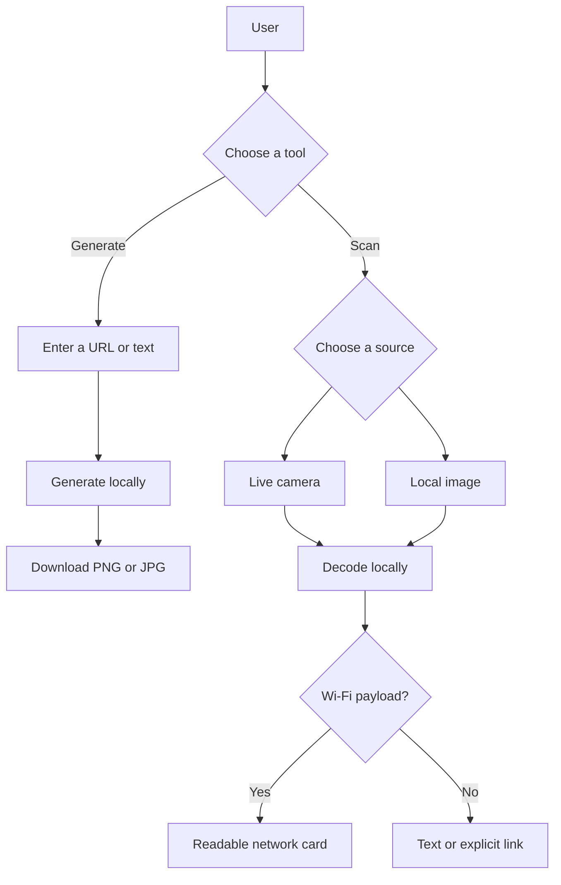

<div align="center">

# CollabScan

**Generate, download, and scan QR codes privately in your browser.**

A lightweight web product by [CollabCircle](https://collabcircleofficial.vercel.app/).

</div>


## Product overview

CollabScan is a free, static QR utility designed for quick everyday use. A user can paste a URL or text, generate a high-resolution QR code, and download it as PNG or JPG. Existing QR codes can be decoded with a live camera or a local image.

Everything happens on the user's device. CollabScan has no application server, database, account system, analytics pipeline, or upload endpoint. QR contents, uploaded images, Wi-Fi credentials, and camera frames are not sent to CollabCircle.

## Why CollabScan is useful

- **Quick sharing:** turn links, contact details, event information, or short text into a scannable image.
- **Flexible downloads:** export a clean PNG for digital use or JPG for workflows that require it.
- **Two ways to scan:** use a live rear-facing camera or choose an existing image.
- **Readable Wi-Fi results:** network name and security are presented clearly; passwords are masked until requested and can be copied.
- **No registration:** there are no accounts, subscriptions, quotas, or saved histories.
- **Privacy by design:** generation and decoding remain inside the browser.
- **Works across devices:** the interface adapts to desktop, tablet, and mobile screens.
- **Easy to host:** the production build is a collection of static files deployable through a CDN.

## Features

- Generate QR codes from URLs or plain text.
- High error-correction output for dependable scanning.
- Download as PNG or JPG.
- Scan with a device camera.
- Decode PNG, JPG, WebP, and GIF files up to 10 MB.
- Parse standard Wi-Fi QR payloads, including escaped characters and hidden networks.
- Mask, reveal, and copy Wi-Fi passwords.
- Display decoded content without executing it.
- Open explicit HTTP(S) results only after user interaction.
- Responsive, keyboard-accessible controls and reduced-motion support.
- Build-time validation of footer social links.
- Static export with no backend or database.

## CollabCircle

CollabScan is designed and maintained by **CollabCircle**, a technology startup focused on practical, accessible digital products.

| Channel   | Official link                                                                    |
| --------- | -------------------------------------------------------------------------------- |
| Website   | [collabcircleofficial.vercel.app](https://collabcircleofficial.vercel.app/)      |
| LinkedIn  | [CollabCircle Official](https://www.linkedin.com/company/collabcircle-official/) |
| Facebook  | [collabcircle.official](https://www.facebook.com/collabcircle.official)          |
| Instagram | [@collabcircle.official](https://www.instagram.com/collabcircle.official/)       |
| X         | [@CollabCircle1](https://x.com/CollabCircle1)                                    |
| YouTube   | [@collabcircle.official](https://www.youtube.com/@collabcircle.official)         |

## How it works



Additional design details are in [docs/ARCHITECTURE.md](docs/ARCHITECTURE.md). Security reporting and controls are documented in [SECURITY.md](SECURITY.md).

## Technology

| Area          | Technology              | Role                                    |
| ------------- | ----------------------- | --------------------------------------- |
| Framework     | Next.js 16 and React 19 | Application structure and static export |
| Language      | TypeScript 6            | Strict type safety                      |
| QR generation | `qrcode`                | Local QR image creation                 |
| QR scanning   | `html5-qrcode`          | Camera and image decoding               |
| Icons         | Lucide React            | Tree-shakeable SVG interface icons      |
| Styling       | Plain CSS               | Lightweight responsive presentation     |

## Requirements

- Node.js 20.9 or newer
- npm 10 or newer
- HTTPS in production for camera access

## Local development

```bash
git clone https://github.com/CollabCircle-Official/CollabScan.git
cd CollabScan
npm install
```

Copy `.env.example` to `.env.local`, configure the public social URLs, and start the development server:

```bash
npm run dev
```

Open `http://localhost:3000`.

## Environment configuration

Social URLs are read during the build, validated as HTTP(S) URLs, and rendered in the footer. They are public links, not secrets.

| Variable    | Footer destination    |
| ----------- | --------------------- |
| `Website`   | CollabCircle website  |
| `Linkedin`  | LinkedIn company page |
| `Facebook`  | Facebook page         |
| `Instagram` | Instagram profile     |
| `X`         | X profile             |
| `YouTube`   | YouTube channel       |

Keep `.env.local` untracked. Commit only `.env.example`.

## Available commands

```bash
npm run dev        # Start development mode
npm run lint       # Run ESLint
npm run typecheck  # Check TypeScript without emitting files
npm run build      # Produce the static site in out/
npm run security:audit # Check known dependency advisories
```

## Project structure

```text
CollabScan/
|-- docs/
|   `-- ARCHITECTURE.md       # Architecture and data-flow notes
|-- public/
|   |-- images/               # Production visual assets
|   `-- _headers              # Static-host security headers
|-- src/
|   |-- app/                  # Page composition, metadata, and CSS
|   |-- components/
|   |   |-- layout/           # Header and footer
|   |   `-- qr/               # Generator, scanner, Wi-Fi result UI
|   `-- lib/                  # Download, social, and Wi-Fi helpers
|-- .env.example              # Safe public configuration template
|-- SECURITY.md               # Security policy and reporting
|-- eslint.config.mjs
|-- next.config.ts
|-- package.json
|-- tsconfig.json
`-- vercel.json               # Vercel security headers
```

## Security and privacy

- No decoded data is persisted or transmitted by the application.
- Uploaded files are restricted by MIME type and limited to 10 MB.
- Generator input is limited to 2,048 characters.
- React escapes decoded text before rendering.
- External links use isolated tabs with `noreferrer`.
- Wi-Fi passwords are masked by default.
- Camera permission is requested only after the user chooses it.
- CSP, permission, clickjacking, MIME, referrer, and cross-origin policies are supplied for supported hosts.
- `npm audit` should be run during every release and dependency update.

Because CollabScan is static, server-side injection, database compromise, account takeover, and application-upload abuse are not part of its architecture. DDoS protection, traffic filtering, request logging, and edge rate limiting remain responsibilities of the selected CDN or hosting provider.

## Deployment

Run:

```bash
npm run build
```

Deploy the generated `out/` directory to Vercel, Netlify, Cloudflare Pages, GitHub Pages, or another static host. Configure social variables in the build environment and enforce HTTPS.

- `vercel.json` applies the security policy on Vercel.
- `public/_headers` supports hosts that recognize the `_headers` convention.
- Other hosts must be configured to send the equivalent headers from `SECURITY.md` or `public/_headers`.

For public production traffic, enable the host's CDN, managed DDoS protection, deployment access controls, dependency alerts, and domain-level HTTPS/HSTS settings.

## Release checklist

```bash
npm ci
npm audit
npm run lint
npm run typecheck
npm run build
```

Then verify camera scanning on HTTPS, image scanning, both download formats, Wi-Fi parsing, footer links, mobile layout, and response headers.

## Contributing

1. Create a focused branch.
2. Keep UI, parsing, and utilities modular.
3. Do not commit environment files, generated output, or credentials.
4. Run the complete release checklist.
5. Open a pull request describing behavior and security impact.

## License

Released under the [MIT License](LICENSE). Copyright (c) 2026 CollabCircle Official.
