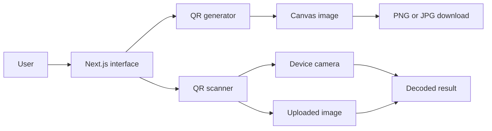
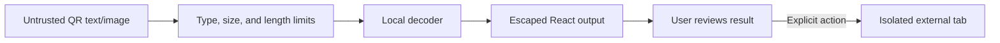

# Architecture

CollabScan is a statically exported Next.js application. It has no API routes, server, database, analytics, or user accounts.

## Module boundaries

- `src/app`: page composition, metadata, fonts, and global styling.
- `src/components/layout`: site-wide header and footer.
- `src/components/qr`: isolated generator, scanner, and mode-switching interface.
- `src/lib`: helpers for downloads and social-link validation.
- `public`: static assets served without transformation.

## Privacy and static deployment

Generation and decoding happen locally in the browser. Images are not transmitted. Camera access requires browser permission and HTTPS or localhost. `output: "export"` creates an `out/` directory for any static host. Environment variables must be available at build time.

Decoded Wi-Fi payloads are parsed locally into network name, security, visibility, and password fields. Passwords are masked by default; the original payload is available only inside an expandable details control.

## Trust boundaries

- QR contents and files are untrusted input and are never interpreted as HTML or code.
- Uploaded images must use a supported image MIME type and remain under 10 MB.
- Generated content is capped at 2,048 characters.
- URL results require an explicit user action and open with `noreferrer` isolation.
- Browser permissions allow camera use but deny microphone, geolocation, payment, and USB access.
- Static hosting headers restrict scripts, framing, object embedding, referrers, and cross-origin behavior.

Controls outside this repository include TLS termination, HSTS, CDN caching, DDoS mitigation, domain security, and hosting access logs. Those must be configured at the deployment provider.
